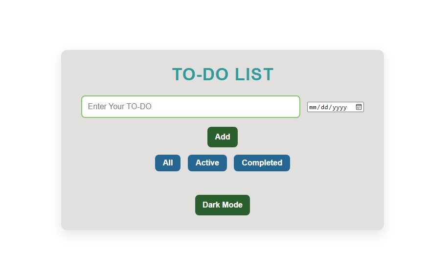
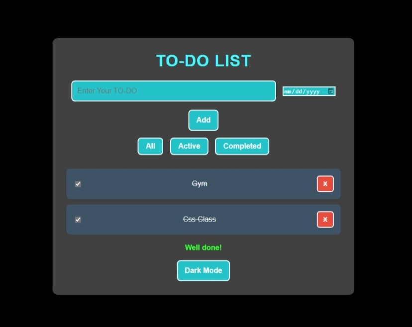

# Simple To-Do List ✅📝

A responsive and user-friendly To-Do List application built with HTML, CSS, and JavaScript (jQuery). It allows users to add tasks, mark them as completed, and filter tasks based on their status (All, Active, Completed). The application also includes a Dark Mode toggle for better usability.




## Features
- Add tasks with optional due dates.
- Mark tasks as completed or delete them.
- Filter tasks by:
  - All
  - Active
  - Completed
- Toggle between Light Mode and Dark Mode.
- Displays a motivational message ("Well done!") when all tasks are completed.

## Technologies Used
- **HTML5**: Markup for structure.
- **CSS3**: Styling and layout.
- **JavaScript (jQuery)**: Functionality and interactivity.

## Getting Started

### Prerequisites
- A modern web browser.

### Installation
1. Clone the repository:
   ```bash
   git clone https://github.com/muaz64/Simple-To-Do-List.git
   ```
2. Open the `index.html` file in your browser.

## Usage
1. Enter your task in the input field.
2. Click "Add" to add the task to the list.
3. Use the "All," "Active," and "Completed" buttons to filter tasks.
4. Toggle Dark Mode using the "Dark Mode" button for a different theme.

## Screenshots
### Light Mode


### Dark Mode


## Contributing
Contributions are welcome! Please feel free to submit a Pull Request or open an Issue.

## License
This project is licensed under the MIT License.

---

Check out the live project or view the source code: [GitHub Repository](https://github.com/muaz64/Simple-To-Do-List.git)


---